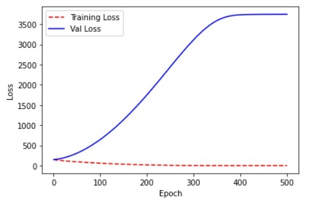
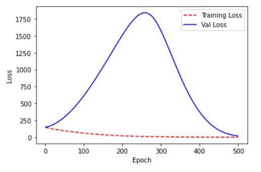

# Lab1 Frequently Asked Questions (FAQs)

Those are the answer of the most frequently asked questions in lab1.

## 1. model.summary() fails

If you get the following error:


This means that you haven't specify the input shape in the dense layer. The dense layer accepts only the shape of the input, the number of data examples shouldn't be specified, so in case of lab1 the input shape will be specified as following

```python
input_shape=(X_tr.shape[1],)
```

## 2. None in the output shape

What is the None in the output shape?


None in shape means variable, in this case None refers to the batch size, since it's variable and depends on the runtime value. Always expect first field in the shape to be related to batch size.

## 3. Can I use activation functions in linear regression? Relu? Tanh?

No, definitely you cannot, the name linear itself comes from 'linear activation' aka 'no activation'. So, it doesn't matter if it gives you better accuracy or not, you cannot use it otherwise you will be solving the problem with a different solution.

## 4. Can I use any activation function for logistic regression?

No, use only activation functions that their output range is [0, 1].

## 5. Can I use many perceptrons or dense layers in logistic regression?

No, you cannot, since the produced model will not be a logistic regression, it will be a neural network.

## 6. Can I use many perceptrons or dense layers in linear regression?

You can, but you shouldn't. It doesn't matter how many layers or perceptrons you add to the network, since you will use linear activation functions, this means that whichever network you have, it can be represented by one perceptron. Which means that adding extra layers or perceptrons is a waste of resources. It doesn't make any sense to build a nuclear power station to charge your mobile battery.

You can find [here](https://www.geeksforgeeks.org/activation-functions-neural-networks/) a proof why any neural network with many linear perceptrons and layers can be reduced to one perceptron.

Use [this playground](http://playground.tensorflow.org/#activation=linear&regularization=L2&batchSize=30&dataset=circle&regDataset=reg-plane&learningRate=0.03&regularizationRate=0.003&noise=0&networkShape=8,8,8,8,8,1&seed=0.18289&showTestData=false&discretize=true&percTrainData=50&x=true&y=true&xTimesY=false&xSquared=false&ySquared=false&cosX=false&sinX=false&cosY=false&sinY=false&collectStats=false&problem=classification&initZero=false&hideText=false) to see how many can produce linear output.

## 7. Which accuracy should I expect? What is the purpose of this lab?

There's not a specific accuracy required. You're just required to get your hands dirty and try different variations and see how those variations affect the results and plots then **try to** justify those effects.

## 8. How is training accuracy lower than validation accuracy?

You might produce plot like the following:


This plot usually means that the data split distribution is not very good. It means that the distribution of the validation data is bad, and most of the validation data is similar to only a subset of the training data on which the model has been trained very well. So, this is not a problem of your model itself.

## 9. Why does the accuracy plot change under the same circumstances for different runs?

There're many random operations that are applied behind the scenes, for instance, random weights initialization, this might put the initial state of the model at different point on the loss curve per one run, but eventually incase of convex optimization (our problems here) they will all reach the same final point, so they will all almost produce the same final accuracy. To understand more how to control this randomization to reproduce the same results and plots in all cases, please have a look at [this article](https://deeplizard.com/learn/video/HcW0DeWRggs).

## 10. Why did linear regression overfit too much?

If you produce a plot like the following:



This means that your model is overfitting, you can solve this issue by adding regularization. Adding activation functions is not an option since this is a linear regression problem.

## 11. Is this some sort of overfitting?

If you produce a plot like the following:



This is **not** overfitting, we only care about final result, at 200 epochs yes there was overfitting, but after 500 epochs the model managed to train very well which is our objective.

## 12. What types of scaling (normalization) should we apply?

You can try ready to use scaling methods from keras, tensorflow, or scikit-learn such as log scaling, max-min scaling, or standardization.

## 13. Can scaling make accuracy worse?

Yes. Generally it shouldn't but it can. We apply scaling to avoid the model getting biased by signle or a set of features, we want all features to have the same initial weight, now what if the model has an initial weight (by chance) which is biased to the most important features? this will makes the model pay more attention to those features and hence achieving better results, so if you apply scaling in this case, it will only make things worse. But, you're to try all the variants and choose whichever works best for you. If you have a resources problem and cannot test all the variants, then always use scaling.

## 14. What type of preprocessing is required at part2?

You could start by applying what I did in part1 and try to google for extra preprocessing methods if you wish. Nothing specific is required, just get your hands dirty.

## 15. What is meant by aritificial features? How many should we add?

Assume [this case](http://playground.tensorflow.org/#activation=linear&regularization=L2&batchSize=30&dataset=circle&regDataset=reg-plane&learningRate=0.03&regularizationRate=0.003&noise=0&networkShape=1&seed=0.60487&showTestData=false&discretize=true&percTrainData=50&x=true&y=true&xTimesY=false&xSquared=false&ySquared=false&cosX=false&sinX=false&cosY=false&sinY=false&collectStats=false&problem=classification&initZero=false&hideText=false) in which we have two input features x1 and x2, since the logistic regression will produce a linear boundary, this means that we will never represent the data good enough. What we can do to solve this issue, is to feed our model with extra artificial features let's name them x3 and x4, but actually there's no x3 and x4 in our data, we just let x3 = x1^2 and x4 = x2^2 for example as seen in [this case](http://playground.tensorflow.org/#activation=linear&regularization=L2&batchSize=30&dataset=circle&regDataset=reg-plane&learningRate=0.03&regularizationRate=0.003&noise=0&networkShape=1&seed=0.60487&showTestData=false&discretize=true&percTrainData=50&x=true&y=true&xTimesY=false&xSquared=true&ySquared=true&cosX=false&sinX=false&cosY=false&sinY=false&collectStats=false&problem=classification&initZero=false&hideText=false). So, we can always feed extra artificial features to better fit our data, those features might be all sort of variations, we can for example add x5 = x1 * x2, x6 = min(x1, x2) and so on. 

In practice we usually add polynomial artificial features, so if X = [x1 x2] is all data, we usually make something like X = [X X^2 X^3 X^4 X^5], which means we added all polynomial (up to fifth degree) artificial features of **all** input features. Something like that can easily done in part two as following, if we want X = [X X^3]

```python
cubic_X = X ** 3
X = np.concatenate((X, cubic_X), axis=1)
```

A good practice is to have the maximum degree of the polynomial of odd degre, since the quadratic degree often have an inflecting point which might not fit very well with the data.

You're required to try different variations of the artificial features and report which case was better.