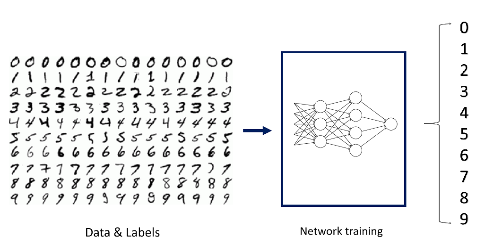
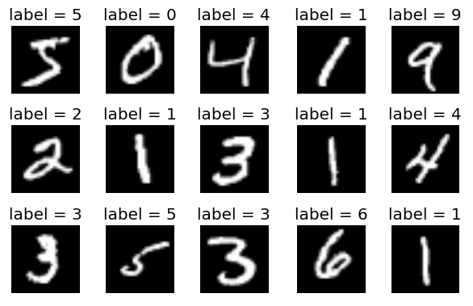

# Lab2: Multinominal Classification

## 1 - Objectives

* Building a model for multinominal classification task.
* Knowing the effect of using CNNs in models.

## 2 - MNIST Dataset

The MNIST is a dataset of handwritten digits, has a training set of 60,000 examples, and a test set of 10,000 examples.

[This is](http://yann.lecun.com/exdb/mnist/) the original website of the dataset, also, you can have a look at [the dataset on the CSV format on kaggle](https://www.kaggle.com/oddrationale/mnist-in-csv), you can check the notebooks and ideas applied on it on Kaggle.

Also, the dataset is [builtin in keras](https://keras.io/api/datasets/mnist/) and you can download & load it directly using one code line.

## 3 - Requirements

* Solve [this notebook](lab2.ipynb) of the assignment and deliver a filled ipython notebook that shows the best output found in your experiments.
* You should deliver a PDF report that has tables summarize all your work and experiments.
