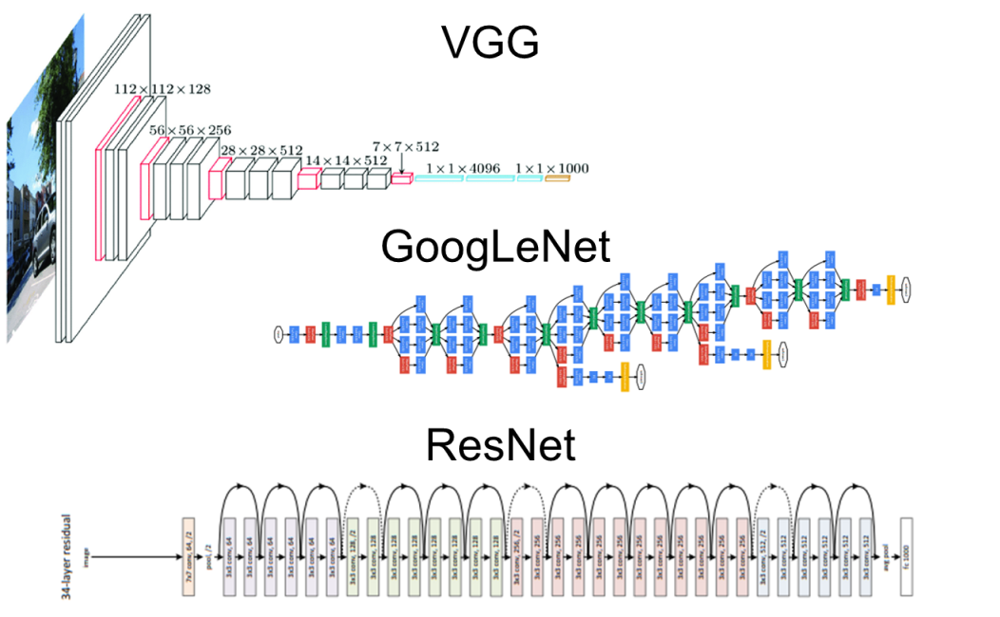
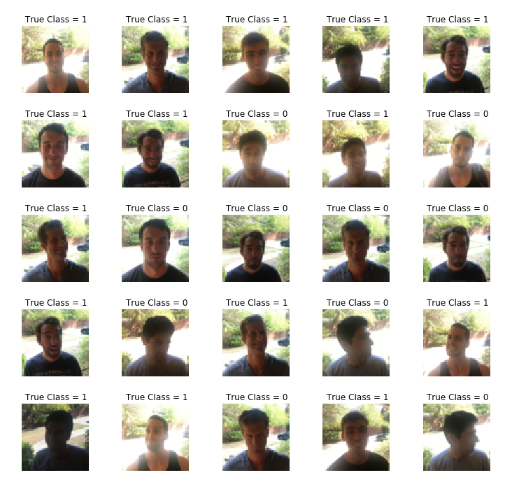

# Lab3: Convolutional Neural Network Use Cases

## 1 - Objectives

1. Building a custom CNN model for a classification task.
2. Using some CNNs case studies (VGG, ResNet & Other use cases).
3. Use transfer learning on the CNNs case studies.
4. Use layers freezing with transfer learning.

## 2 - Happy House Dataset

The dataset is used for emotion classification (two classes, either happy or not). The dataset consists of images and labels as shawn in the following figure, in which class 1 is happy and class 0 is not.

This dataset can be used to solve the Happy House problem. Where, we allow a person to enter the house only if he/she is smiling! So, a smile detector!

The train set has 600 examples.

The test set has 150 examples.

You can find [the dataset on Kaggle](https://www.kaggle.com/iarunava/happy-house-dataset), also you can fine many [code notebooks](https://www.kaggle.com/iarunava/happy-house-dataset/code) for the dataset on Kaggle.

## 3 - Requirements

* Solve [this notebook](lab3.ipynb) of the assignment and deliver a filled ipython notebook that shows the best output found in your experiments in this part.
* You should deliver a PDF report that has tables summarize all your work and experiments.
