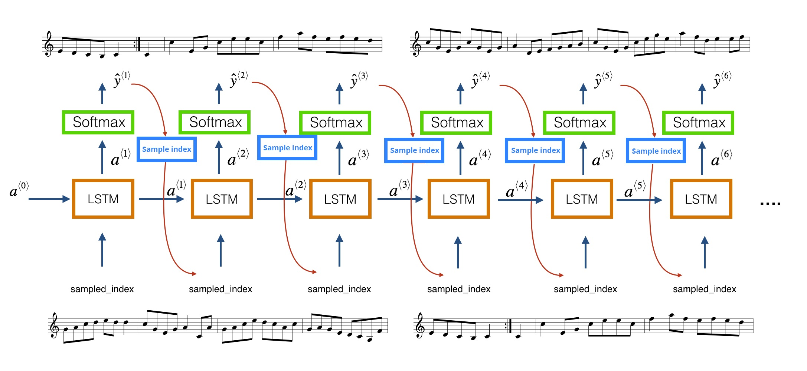

# Lab4: Music Generation with RNNs

## 1 - Objectives

* Building Recurrent Neural Network models.
* Working with the next character prediction model.
* Working with few tensorflow parts instead of tf.Keras.

## 2 - Requirements

* Solve [this notebook](lab4.ipynb) of the assignment and deliver a filled ipython notebook that shows the best output found in your experiments.
* No report is required.
