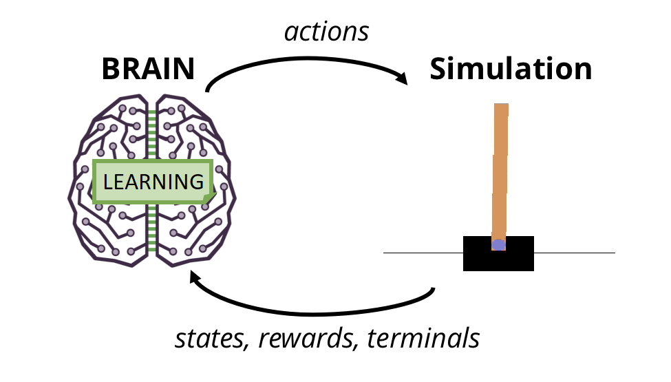

# Lab6: Cartpole - Reinforcement Learning

## 1 - Objectives

* Building deep reinforcement learning models.
* Working with games simulation.

## 2 - Requirements

* Solve [this notebook](lab6.ipynb) of the assignment and deliver a filled ipython notebook that shows the best output found in your experiments.
* Download the produced video and deliver it beside the notebook to the submission form.
* No report is required.
